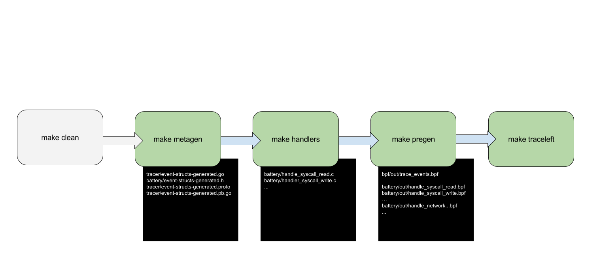

# traceleft build process

## Overview

Building all [traceleft components](overview.md) involves a set of ordered
steps.



To build `traceleft` in one go do:

```
make clean && make
```

This defaults to the following targets, each outlined further below:

```
make clean
make handlers
make pregen
make traceleft
```

The following targets are not triggered by the default target `all`:

```
make protogen
make metagen
```

## Compile Protobuf definitions

```
make protogen
```

Currently only compiles `generator/config.proto -> config.pb.go` which
defines an event type used in the [specification example](../examples/config.json).

Other Protobuf files are generated and compiled later as part of different
targets.

## Generate event C, Go and Protobuf structures with metagenerator

```
make metagen
```

Event structures for C, Go and Protobuf as well as accessor and helper methods
for those are partly autogenerated, partly handwritten templates, and assembled
by `metagenerator/metagenerator.go`.

The following files are generated:

* `tracer/event-structs-generated.go`: Go event structures and methods
* `battery/event-structs-generated.h`: C event structures and methods
* `tracer/event-structs-generated.proto`: Protobuf event and GRPC definitions
* `tracer/event-structs-generated.pb.go`: Go events structures and code,
  compiled from `tracer/event-structs-generated.proto`

## Generate BPF syscall handler C sources

```
make handlers
```

Generates `battery/handler_syscall....c` BPF program C sources with
`cli/traceleft-handlers` according to [config.json](../examples/config.json).

Note: BPF handlers to trace network and file activity are handwritten
currently.

## Compile BPF trace, network, file and syscall handler programs

```
make pregen
```

Builds BPF elf modules from `bpf/trace_events.c` as well as `battery` and
places then into `bpf/out` and `battery/out` respectively.

Also builds a Go asset `../probe/trace-events-generated.go` for the probe to
load. The generated Go source is checked in the git repository. This is useful
for programs using traceleft as a vendored library.

Note: handlers for file and network activity are dependent on a specific kernel
version. We currently use a Fedora based builder (see
[`builder.Dockerfile`](../builder.Dockerfile)) i.e. programs are built on
whatever Fedora kernel is available at the time of the build.

To build on a different kernel, `builder.Dockerfile`, `battery/Makefile` and
`battery/ebpf.mk` will need to be modified.

## Compile traceleft executable

```
make traceleft
```

Finally builds the traceleft executable `build/bin/traceleft`.

## Clean

```
make clean
```

Removes all files generated by `make all`.

## Misc

###  Build network handlers manually

To build the network handlers manually, for instance on Debian, you can do:

```
rm battery/out/*
LINUX_HEADERS='/lib/modules/4.12.0-1-amd64/source /lib/modules/4.12.0-1-amd64/build' \
  DEST_DIR=out \
  CLANG=clang-5.0 \
  LLC=llc-5.0 \
  make -C battery -f ebpf.mk
```
