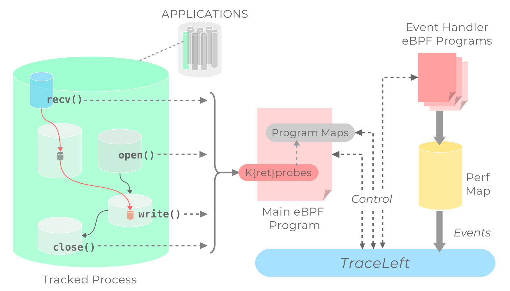

# TraceLeft

TraceLeft is a library to trace applications as well as a small CLI tool 
(`traceleft`) which acts as a reference implementation of the framework. 
It uses Linux [eBPF](https://lwn.net/Articles/740157/) and 
[Kprobes](https://www.kernel.org/doc/Documentation/kprobes.txt) to install 
probes on Linux function calls (both APIs and other internal functions) 
in order to receive callbacks for syscalls, file and network events of a 
traced process. TraceLeft is built using [gobpf](https://github.com/iovisor/gobpf) 
and takes inspiration from the [BCC](https://github.com/iovisor/bcc) toolkit. 
TraceLeft has been designed as a framework to build configuration driven system 
auditing tools as well as application tracing tools used for network and syscall
monitoring. TraceLeft has been tested on kernel versions `v4.4.0` till `v4.16.0`
with eBPF support for Kprobes and Kretprobes. Though eBPF support for static 
tracepoints has landed in recent kernels, one of the early goals of TraceLeft 
was to have it run on older kernels with early eBPF support. Tracepoint support 
is in the works.

The following diagram shows how a set of syscalls and other events from an 
application can be hooked onto using TraceLeft and then eventually tracked through 
the lifecycle of the traced application



Decisions on what process to track and what data to collect per-event can be 
configured to a very fine granularity using Proto/JSON configs. Targeted eBPF handlers 
are generated based on a pre-defined [`config.json`](examples/config.json). Such a
config eventually generates a [battery](battery) of compiled eBPF programs that 
handle each syscall or a network event as the configuration desires. All the eBPF 
handlers are controlled via a main eBPF program. When each handler fires as the tracked
application executes, it generates an **_Event_** which is transmitted via the `perf` map 
to userspace. And event can then be aggregated via a reference 
[event aggregator](documentation/event-aggregation.md) implementation that allows
setting filtering rules on each collected event and provides specifications for 
aggregating events and transferring them over the wire in proto format or to a local 
file.

Detailed documentation can be found in [documentation](documentation) directory.

## Quickstart

Building the `traceleft` binary requires Docker. Details of builds steps are outlined 
in the [build process](documentation/build-process.md) documentation.


```bash
make
sudo build/bin/traceleft trace $PID1,$PID2:battery/out/handle_syscall_read.bpf $PID3:battery/out/handle_syscall_chown.bpf
```

The `$PID` is optional and can be skipped to load a handler as default handler
and trace all processes instead. For example, to trace all `read` syscalls from `vim`

```
[root@gondor traceleft]# build/bin/traceleft trace $(pidof vim):battery/out/handle_syscall_read.bpf 
name read pid 22305 program id 0 return value 1 hash 7914472926735816156 Fd 0<unknown> Buf "i" Count 4096 
name read pid 22305 program id 0 return value 1 hash 7914472926735816156 Fd 0<unknown> Buf "W" Count 4096 
name read pid 22305 program id 0 return value 1 hash 7914472926735816156 Fd 0<unknown> Buf "o" Count 4096 
name read pid 22305 program id 0 return value 1 hash 7914472926735816156 Fd 0<unknown> Buf "l" Count 4096 
name read pid 22305 program id 0 return value 1 hash 7914472926735816156 Fd 0<unknown> Buf "o" Count 4096 
name read pid 22305 program id 0 return value 1 hash 7914472926735816156 Fd 0<unknown> Buf "l" Count 4096 
name read pid 22305 program id 0 return value 1 hash 7914472926735816156 Fd 0<unknown> Buf "o" Count 4096 
name read pid 22305 program id 0 return value 1 hash 7914472926735816156 Fd 0<unknown> Buf "\x1b" Count 4096 
name read pid 22305 program id 0 return value 1 hash 7914472926735816156 Fd 0<unknown> Buf ":" Count 4096 
name read pid 22305 program id 0 return value 1 hash 7914472926735816156 Fd 0<unknown> Buf "w" Count 4096 
name read pid 22305 program id 0 return value 1 hash 7914472926735816156 Fd 0<unknown> Buf "q" Count 4096 
name read pid 22305 program id 0 return value 1 hash 7914472926735816156 Fd 0<unknown> Buf "\r" Count 4096 
```


## Tests

Test can be run using the testing script provided in `tests` directory:


```bash
sudo -E tests/run.sh
```

### Expected output

```bash
Using outfile /tmp/traceleft-test-cli-out-Ecw373
Using outdir /tmp/traceleft-trace-out
Running test_sys_chmod with PID: 7996               [PASSED]
Running test_sys_chown with PID: 8045               [PASSED]
Running test_sys_close with PID: 8099               [PASSED]
...
```

## Related Projects
 - [**BCC Toolkit**](https://github.com/iovisor/bcc): It is a collection of cutting-edge 
 tools that provide advanced tracing capabilities using eBPF. TraceLeft differs 
 from BCC by focusing on maintaining a balance of being configurable as well as being
 easily _composed_ and deployed with minimum dependencies.
 - [**bpfd**](https://github.com/jessfraz/bpfd): This project focuses on the same goals as 
 TraceLeft - of providing filtered trace support on certain system events, it has an 
 additional feature of taking actions based on events and provides a daemon to create
 and remove rules dynamically. In contrast, TraceLeft aims to build single self-
 contained binaries to provide build-time configured tracing support - while allowing 
 much more fine grained control over data obtained from kernel events.
 Unlike `bpfd`, TraceLeft does not reply on [BCC](https://github.com/iovisor/bcc) but does
 require direct compilation of BPF code
 - [**BPFtrace**](https://github.com/ajor/bpftrace): This is a high-level language which 
 allows a easy tracing session control - much like Dtrace and SystemTap and relies 
 on BCC. It compiles BPF code for the scripts directly using LLVM backend APIs while 
 TraceLeft's BPF battery compilation is done using `clang` itself.

## Contributors

 - Suchakra Sharma ([ShiftLeft Inc.](https://shiftleft.io))
 - Iago López Galeiras ([Kinvolk](https://kinvolk.io))
 - Michael Schubert ([Kinvolk](https://kinvolk.io))
 - Alban Crequy ([Kinvolk](https://kinvolk.io))
  

©2018 Shiftleft Inc.