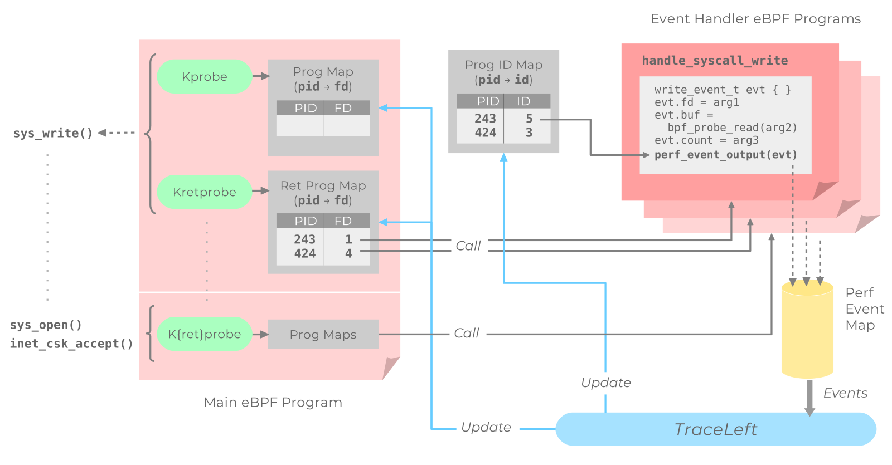

# Design Overview
This document describes the overview of TraceLeft components and their functionality. 
For a detailed understanding of TraceLeft internals, refer some 
[more documents](#list-of-documents)

## Components

### [metagenerator](../metagenerator)

`metagenerator/metagenerator.go` compiles event structures. Currently, these are:

* `battery/event-structs-generated.h`: contains C structs for all known events.
* `tracer/event-structs-generated.go`: contains Go structs and methods for all
  known events.
* `tracer/event-structs-generated.{proto,pb.go}`: contains Protobuf definitions
  for all known events.

That is, by going through the format files in
`/sys/kernel/debug/tracing/events/syscalls/sys_enter_*` for a list of considered
syscalls that are whitelisted for tracing. This is different from filters on tracing

### [generator](../generator)

The `generator` autogenerates eBPF handlers for syscalls according to
[config.json](../examples/config.json)

### [battery](../battery)

The `battery` directory contains a collection of handler eBPF programs. 
The handlers are partly handwritten, partly autogenerated 
(see [generator](../generator))

### [probe](../probe)

The `probe` is responsible for registering and unregistering eBPF handlers and
includes a LRU handler cache.

### [tracer](../tracer)

The `tracer` loads a the probe, starts polling the `events` perf map and
calls the `callback` for each received event.

### [metrics](../metrics)

The `metrics` directory contains experimental aggregator code which aggregates the 
generated TraceLeft events.

## Architecture



traceleft adds k{ret,}probes for all traced syscalls and kernel functions (see
`bpf/trace_syscalls.c` for a list). The only thing the trace probes do is tail
calling handler probes (or return 0 - i.e. do nothing - if no probe was set).

**Examples:**

```
// kprobe
bpf_tail_call(ctx, (void *)&handle_open_progs, pid >> 32); // exec process-specific handler, if set or
bpf_tail_call(ctx, (void *)&handle_open_progs, 0);         // exec default handler, if set or
return 0;                                                  // do nothing

// kretprobe, same principle
bpf_tail_call(ctx, (void *)&handle_open_progs_ret, pid >> 32);
bpf_tail_call(ctx, (void *)&handle_open_progs_ret, 0);
return 0;
```

The handler maps follow the scheme `handle_NAME_progs{,_ret}` where
`NAME` is the name of the traced function (w/o `[Ss]y[Ss]_` prefix in
the case of syscalls).

traceleft provides a single map of type `BPF_MAP_TYPE_PROG_ARRAY` which
handlers must use to send events. All events start with a common section

```
typedef struct {
	uint64_t timestamp;
	uint64_t program_id;
	int64_t  tgid;
	int64_t  ret;
	char     name[64];
	uint64_t hash;
	uint64_t flags;
} common_event_t;
```

to enable the tracer to dispatch events. Specific fields follow after.

The Probe (see `probe/probe.go`; responsible for loading process-specific as
well as default handler probes) expects handler probes to follow the scheme
`kprobe/handle_NAME` and `kretprobe/handle_NAME`, i.e. the name of a
k{,ret}probe defines which handler map to update.

Handler probes can be loaded for a specific pid or as default handler (`pid == 0`).

# List of Documents

 - **[Build Process](build-process.md):** Outlines the process of building `traceleft`
 binary in details and the process that goes underneath in detail
 - **[Event Aggregation](event-aggregation.md):** Defines the event aggregation spec 
 and TraceLeft APIs that allow aggregation of generated trace events
 - **[File Tracking](file-tracking.md):** Discusses the lengths upto which traceleft
 tries to go to track file lifecycles with BPF probes
 - **[Add a Syscall](add-new-syscall.md):** Shows how a new syscall tracing support 
 can be added to TraceLeft
 - **[Network Tracking](network-tracking.md):** Describes how network events are tracked
 using custom BPF probes provided by TraceLeft
 - **[Profiling and Performance](profiling-and-performance.md):** Explains how Traceleft's  
 performance can be measured using with `pprof` and `perf`
