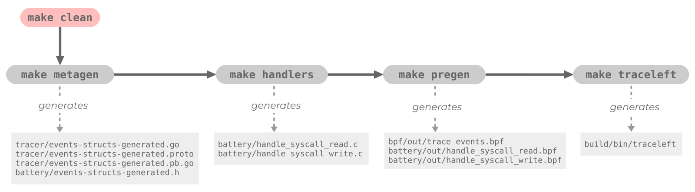

# TraceLeft Build Process

## Overview

Building all [TraceLeft components](README.md) involves a set of ordered
steps. TraceLeft is designed to produce single self-sufficient binaries based 
on pre-defined static configurations that can however be applied dynamically 
to target processes. The `traceleft` binary produced as a result of this build
process is an example where a pre-defined 
[event configuration](../examples/config.json) can then be applied to whatever
process that user wants to trace dynamically. For example, with traceleft, one 
can trace `open` and `close` events for a text editor having PID `4242` while 
tracing `chmod` events for Slack process having PID `1234` - all with a single 
binary. The build steps are illustrated below:



To build `traceleft` in one go do:

```
make clean && make
```

This defaults to the following targets, each outlined further below:

```
make clean
make handlers
make pregen
make traceleft
```

The following targets are not triggered by the default target `all`:

```
make protogen
make metagen
```

## Detailed Process
This section describes in detail each step in the build process which generates 
event structures, BPF handlers and compiled BPF programs based on input event 
specifications. The various steps are detailed here chronologically.

### Compile Protobuf Definitions

```
make protogen
```

Currently only compiles `generator/config.proto -> config.pb.go` which
defines an event type used in the `config.json` 
[event specification example](../examples/config.json).

Other Protobuf files are generated and compiled later as part of different
targets.

### Generate Event Structures

These steps generate the trace event's C, Go and Protobuf structures using `metagenerator`

```
make metagen
```

Event structures for C, Go and Protobuf as well as accessor and helper methods
for those are partly autogenerated, partly handwritten templates, and assembled
by `metagenerator/metagenerator.go`.

The following files are generated:

* `tracer/event-structs-generated.go`: Go event structures and methods
* `battery/event-structs-generated.h`: C event structures and methods
* `tracer/event-structs-generated.proto`: Protobuf event and GRPC definitions
* `tracer/event-structs-generated.pb.go`: Go events structures and code,
  compiled from `tracer/event-structs-generated.proto`

### Generate BPF Syscall Handlers

This generates the C sources for the BPF handlers for syscalls

```
make handlers
```

Generates `battery/handler_syscall....c` BPF program C sources with
`cli/traceleft-handlers` according to [config.json](../examples/config.json).

Note: BPF handlers to trace network and file activity are handwritten
currently.

### Compile BPF Handlers

This compiles the trace, network, file and syscall handler BPF programs and
prepares them for insertion in the kernel

```
make pregen
```

Builds BPF elf modules from `bpf/trace_events.c` as well as `battery` and
places then into `bpf/out` and `battery/out` respectively.

Also builds a Go asset `../probe/trace-events-generated.go` for the probe to
load. The generated Go source is checked in the git repository. This is useful
for programs using traceleft as a vendored library.

> :information: Note: handlers for file and network activity are dependent on a specific kernel
version. We currently use a Fedora based builder (see
[`builder.Dockerfile`](../builder.Dockerfile)) i.e. programs are built on
whatever Fedora kernel is available at the time of the build.

To build on a different kernel, `builder.Dockerfile`, `battery/Makefile` and
`battery/ebpf.mk` will need to be modified.

### Compile `traceleft` Executable

```
make traceleft
```

Finally builds the traceleft executable `build/bin/traceleft` which is a reference 
implementation and can be used to trace applications and generate alerting events

### Clean

```
make clean
```

Removes all files generated by `make all`

### Misc

####  Build Network Handlers Manually

To build the network handlers manually, for instance on Debian, you can do:

```
rm battery/out/*
LINUX_HEADERS='/lib/modules/4.12.0-1-amd64/source /lib/modules/4.12.0-1-amd64/build' \
  DEST_DIR=out \
  CLANG=clang-5.0 \
  LLC=llc-5.0 \
  make -C battery -f ebpf.mk
```
